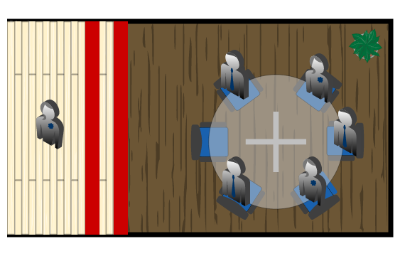
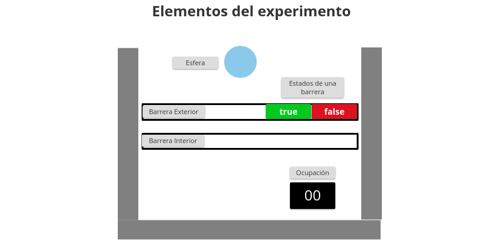
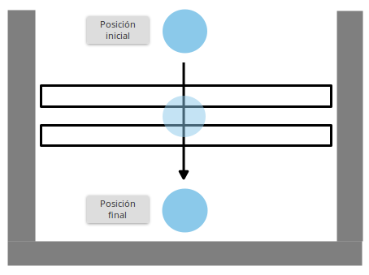
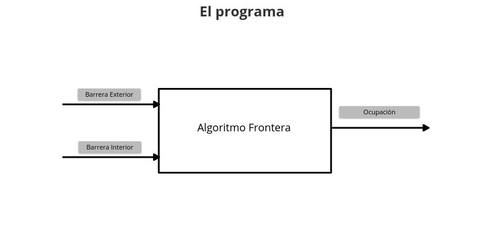
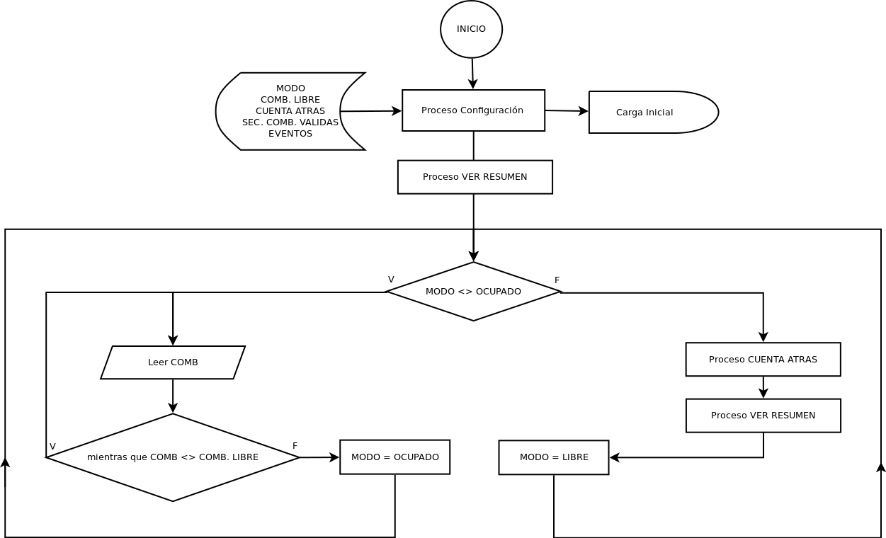
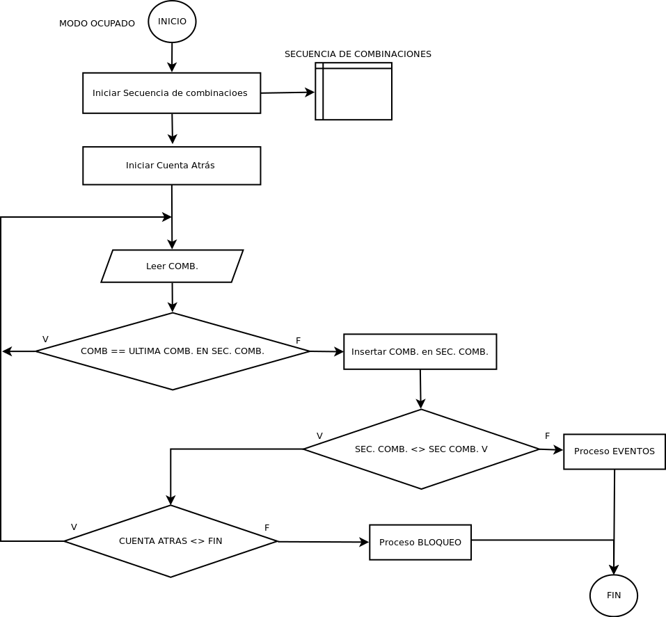
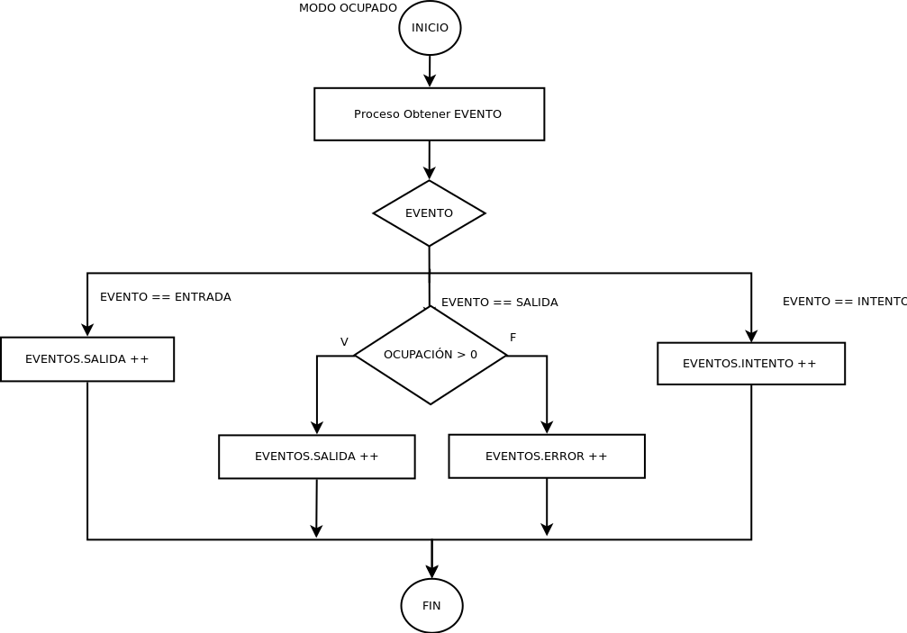
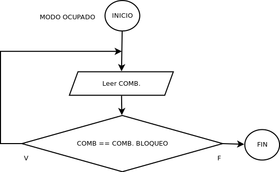
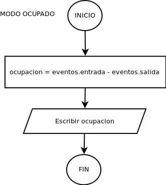

# Definición

Se quiere **obtener el número de personas que se encuentran en una zona**, para conseguirlo el programa procesa las entradas o salidas de un individuo a través de una frontera compuesta por dos líneas paralelas (interior  y exterior) en disposición horizontal.

La intersección del individuo con estas líneas durante su movimiento provee de unos datos que son procesados y analizados para devolver la **ocupación** actual de una zona.

# El experimento

## 

## Esfera

Para ajustar las posibilidades de error con asuntos relacionados con la altura de las barreras o la distancia paralela entre las barreras, se emplea una **esfera con diámetro conocido **en representación a un individuo**. **Esta esfera será la encargada de interceder con las barreras para que estas adquieran estados que puedan ser procesados por el programa.

<table>
  <tr>
    <td>Usar interruptores en lugar de una esfera.</td>
  </tr>
</table>

### Dimensiones

Para un funcionamiento óptimo del programa, se definen dos condiciones para la esfera:

* El diámetro de la esfera no puede ser menor a la altura de las barreras

* El diámetro de la esfera no puede ser menor que la distancia entre las barreras.

### Movimiento de la esfera

La esfera se desliza sobre el plano en dirección perpendicular a las barreras.

La esfera puede:

* avanzar

* retroceder

* mantenerse inmóvil

Ejemplo de un movimiento de entrada

## Barrera

Con el fin de mejorar el conteo de precisión, la altura de la instalación de las barreras es importante.

<table>
  <tr>
    <td>Usar interruptores en lugar de sensores de corte.</td>
  </tr>
</table>

### Estados de la barrera

* TRUE       Está siendo cortada

* FALSE     No está siendo cortada

### Tipos de barrera

Para el realizar el control de entrada y salida se diferenciarán las barreras para poder identificar el sentido del movimiento:

* Barrera exterior

* Barrera interior

## Pareja de barreras: Combinación

Una **combinación** es la agrupación de los estados que tienen las barreras en un determinado momento.

<table>
  <tr>
    <td>BARRERA INTERIOR  BARRERA EXTERIOR</td>
  </tr>
</table>

<table>
  <tr>
    <td>BARRERA INTERIOR  BARRERA EXTERIOR</td>
  </tr>
</table>

<table>
  <tr>
    <td>BARRERA INTERIOR  BARRERA EXTERIOR</td>
  </tr>
</table>

<table>
  <tr>
    <td>BARRERA INTERIOR  BARRERA EXTERIOR</td>
  </tr>
</table>

## Secuencia de Combinaciones

Una secuencia de combinaciones es la encargada de almacenar los cambios que experimentan las combinaciones en un intervalo de tiempo. Es la estructura que contiene las variaciones que ha recibido el programa.

Ejemplo:

LIBRE

<table>
  <tr>
    <td>1.</td>
    <td>BARRERA INTERIOR  BARRERA EXTERIOR</td>
  </tr>
  <tr>
    <td>2.</td>
    <td>BARRERA INTERIOR  BARRERA EXTERIOR</td>
  </tr>
</table>

### Secuencia de Combinaciones Válida

Una secuencia de combinaciones es válida cuando se cumple un patrón determinado.

Si el programa registra una combinación válida emite un evento.

Ejemplo:

LIBRE

<table>
  <tr>
    <td>1.</td>
    <td>BARRERA INTERIOR  BARRERA EXTERIOR</td>
  </tr>
  <tr>
    <td>2.</td>
    <td>BARRERA INTERIOR  BARRERA EXTERIOR</td>
  </tr>
</table>

## Modo Libre

**El programa comienza en modo libre** con la siguiente Secuencia de Combinaciones:

LIBRE

<table>
  <tr>
    <td>1.</td>
    <td>BARRERA INTERIOR  BARRERA EXTERIOR</td>
  </tr>
</table>

### Cuándo se establece el modo ocupado

En el momento en el que se registre una combinación diferente a la anterior.

## Modo Ocupado

### Cuenta atrás

Al iniciarse el modo ocupado comienza una cuenta atrás y su duración viene configurada por el **Intervalo de tiempo**. Durante este intervalo el programa estará registrando una secuencia de combinaciones.

### Cuándo se establece el modo libre

Se registra una secuencia de combinaciones no válida.

Se registra una secuencia de combinaciones válida (de entrada o de salida)

Inicio del programa

Fin de la cuenta atrás (a excepción de que sea lanzado el evento bloqueo)

## Eventos

### Entrada

Ocurre cuando se captura una secuencia de combinaciones válida de entrada

### Salida

Ocurre cuando se captura una secuencia de combinaciones válida de salida

### Intento

Cuando se captura un combinación que no es válida

### Error

Cuando una operación no se permite. ( ej. OCUPACIÓN = 0 con evento SALIDA produce evento ERROR )

## Contador

El contador muestra un número que representa la ocupación en un determinado momento.

Por otra parte es el encargado de manejar los eventos que emiten el modo ocupado.

* El contador tiene el valor cero al inicio del programa.

* Si se produce un evento ENTRADA el contador incrementa una unidad sobre el valor actual.

* Si se produce un evento SALIDA el contador decrementa una unidad sobre el valor actual.

* El contador de aforo nunca puede ser menor que cero, en caso de darse el caso, prevenir y lanzar un aviso.

# El programa

## Diagramas de Flujo

### Configuración y modos

### Proceso Cuenta Atrás

### Proceso Eventos

### 

### Proceso Bloqueo

### Proceso Ver Resumen

